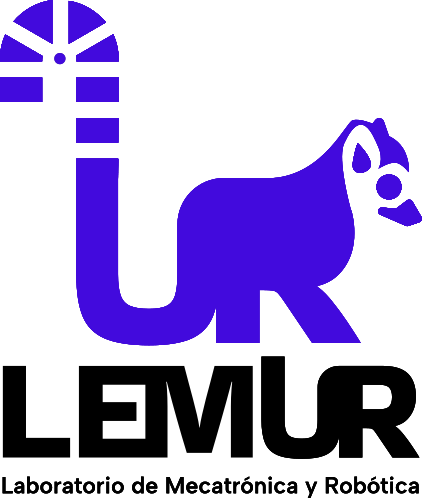

# RC Car ESP32 DIY 🏎️🔋

*Author: Francisco Cáceres* ✍️

## English Version 🇺🇸

### 🌟 Project Overview
Welcome to the **RC-Car-ESP32-DIY** repository! This project details the design, fabrication, and programming of a compact **Wireless Robotic Vehicle**.

Powered by the versatile **ESP32 microcontroller**, this mobile robot features a **differential drive system** and offers dual-mode wireless control via **WiFi** or **Bluetooth**. A key engineering feature is its custom-designed **PCB Chassis**, which integrates the **TB6612FNG Motor Driver**, power management for **18650 Li-Ion batteries**, and LED indicators into a single structural unit. It is a multidisciplinary project integrating:

* **PCB Design** (Custom structural board integrating logic and power).
* **Mechanical Design** (3D printed mounts and caster assembly).
* **Embedded Systems** (ESP32 firmware for wireless communication and motor control).
* **Control Strategies** (Teleoperation via Bluetooth/WiFi).

---

## Versión en Español 🇪🇸

### 🌟 Resumen del Proyecto
¡Bienvenido al repositorio **RC-Car-ESP32-DIY**! Este proyecto detalla el diseño, fabricación y programación de un **Vehículo Robótico Inalámbrico** compacto.

Controlado por el versátil microcontrolador **ESP32**, este robot móvil cuenta con un **sistema de tracción diferencial** y ofrece control inalámbrico de doble modo vía **WiFi** o **Bluetooth**. Una característica clave de ingeniería es su **Chasis de PCB** diseñado a medida, que integra el driver de motores **TB6612FNG**, gestión de energía para **baterías Li-Ion 18650** e indicadores LED en una única unidad estructural. Es un proyecto multidisciplinario que integra:

* **Diseño de PCB** (Placa estructural personalizada integrando lógica y potencia).
* **Diseño Mecánico** (Soportes impresos en 3D y ensamblaje de rueda loca).
* **Sistemas Embebidos** (Firmware ESP32 para comunicación inalámbrica y control de motores).
* **Estrategias de Control** (Teleoperación vía Bluetooth/WiFi).

---

## 📚 Documentation & Modules / Documentación y Módulos

Explore the sub-directories below for detailed instructions on each aspect of the build.
*Explora los sub-directorios a continuación para instrucciones detalladas sobre cada aspecto de la construcción.*

| Module / Módulo | Description / Descripción |
| :--- | :--- |
| **📦 [Bill of Materials (BOM)](./BOM/README.md)** | **Purchase List & Printed Parts.**  Full list of hardware (Motors, Batteries, Screws) and the catalog of STL parts required for 3D printing. --- **Lista de Compra y Piezas Impresas.** Listado completo de hardware (Motores, Baterías, Tornillos) y catálogo de STLs para imprimir. |
| **📐 [CAD Design Files](./RC-Car-ESP32-V1/CAD%20v1/README.md)** | **Source Models (Fusion 360 & STEP).**  Download the digital twin of the robot. Includes assembly files and 3D printable mounts for modification. --- **Modelos Fuente (Fusion 360 y STEP).** Descarga el gemelo digital del robot. Incluye archivos de ensamblaje y soportes impresos en 3D para modificar. |
| **📟 [PCB Chassis Manufacturing](./RC-Car-ESP32-V1/PCB%20Chassis%20Manufacturing/README.md)** | **Gerber Files & Layout.**  Production files for the structural PCB manufactured at JLCPCB. Includes footprints and routing. --- **Archivos Gerber y Diseño.** Archivos de producción para la PCB estructural fabricada en JLCPCB. Incluye huellas y enrutamiento. |
| **⚡ [Electronics & Schematics](./RC-Car-ESP32-V1/Electronics%20v1/README.md)** | **Schematics & Diagrams.**  Detailed wiring of the ESP32, TB6612FNG Driver, and power management circuit. --- **Esquemas y Diagramas.** Cableado detallado del ESP32, Driver TB6612FNG y circuito de gestión de energía. |
| **💻 [Software & Firmware](./RC-Car-ESP32-V1/Code%20v1/README.md)** | **ESP32 Firmware.**  Source code (`.ino` / `.cpp`) for WiFi/Bluetooth connectivity and differential motor control logic. --- **Firmware de ESP32.** Código fuente (`.ino` / `.cpp`) para conectividad WiFi/Bluetooth y lógica de control diferencial de motores. |
| **📸 [Multimedia Gallery](./Multimedia/README.md)** | **Renders & Visuals.**  High-quality renders of the assembly, PCB previews, and photos of the final prototype. --- **Renders y Visuales.** Renders de alta calidad del ensamblaje, vistas previas de la PCB y fotos del prototipo final. |

---

## 🎓 Acknowledgments / Agradecimientos

This project was made possible thanks to the support and facilities provided by the **University of Chile**.

*Este proyecto fue posible gracias al apoyo y las instalaciones provistas por la **Universidad de Chile**.*

| Institution / Institución | Contribution / Contribución |
| :---: | :--- |
|  | **LEMUR (Laboratorio de Ingeniería Mecatrónica y Robótica)** For providing the workspace and tools required for the robot assembly and testing. *(Por proveer el espacio y herramientas necesarias para el ensamblado y pruebas del robot).* |

---
*Open Source Project - 2025*
